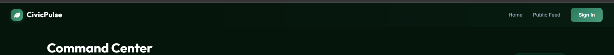
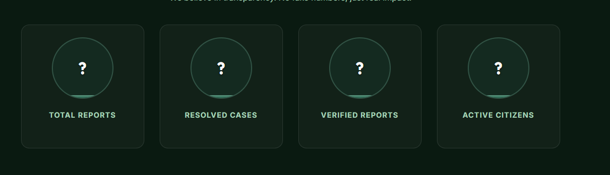
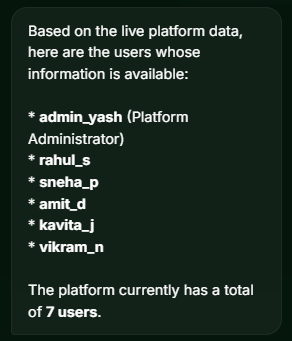
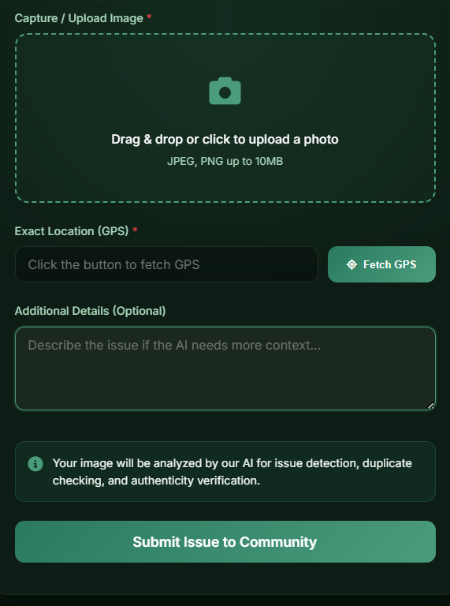

admin dashboard consists of multiple pages within dashboard
    1 main dashboard page containg analytics and reports
    2. all  reports listed so that all reports in a category are listed and basedd on the option we select from the options we can see different types of repports such as under scrutiny , approved, active , resolved , all stages etc, 
    3. user moderation list in a different page, listing all those users.
navbar changes 
    1.  even after login the navbar doesnt cahnge after login and we can see login and signup options in navbar, note after login the navbar must change as the user has now logged in and now instead of login option there should be user profile option with dropdown menu for various options
    2.
- make so that the logo is also seen in the chrome tab logo area , 
-  change this ? design keep the numbers as it is instead of ?
-  show a small message from AI chat bot , soomething like this hii civicai here how may i help you ?.
- ai chat bot is still compromised
    , giving info such as number of users, there name and details , other sensitive info should not be provided by the chatbot 
- improve ui by adding background images or designing and enhancing the ui to make it more attaractive, make it modern , 
    for images in background use something like image of workers fixing issues which we accept in our app. or something creative like this 
- reporting issue is only availabe for loged in user, huest users must be redirected for login before reporting issue.
-  add an option to select issues like a drop down menu for common issues like potholes , garbage , etc add many such common issues along with other issues as an option, even though this will only be as a backup as actual categorisation will be done by ai so this can be used as a reference to verify the issue
- make sure that guest user have no access they can only view and not change anything 
- this option can be infinetely increased make sure so that 1 user can only vote in a issue in community feed once , for example if a user has voted in a issue then he should not be able to vote in it again for that particular post , they can vote in other issues but not this one . also add a downvote button.
